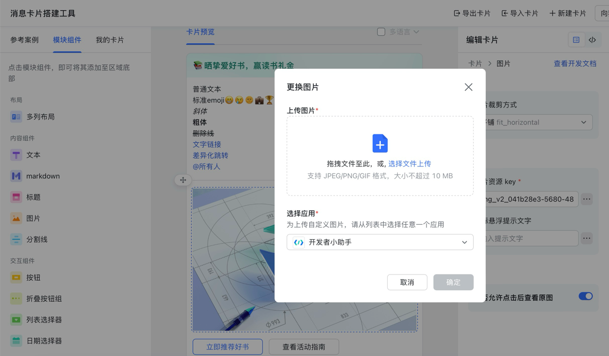
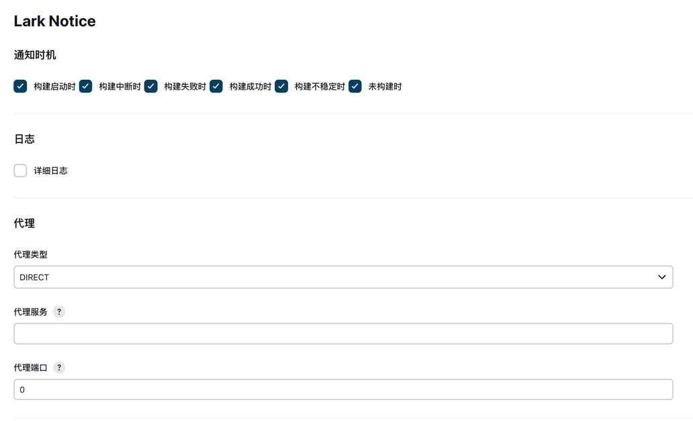
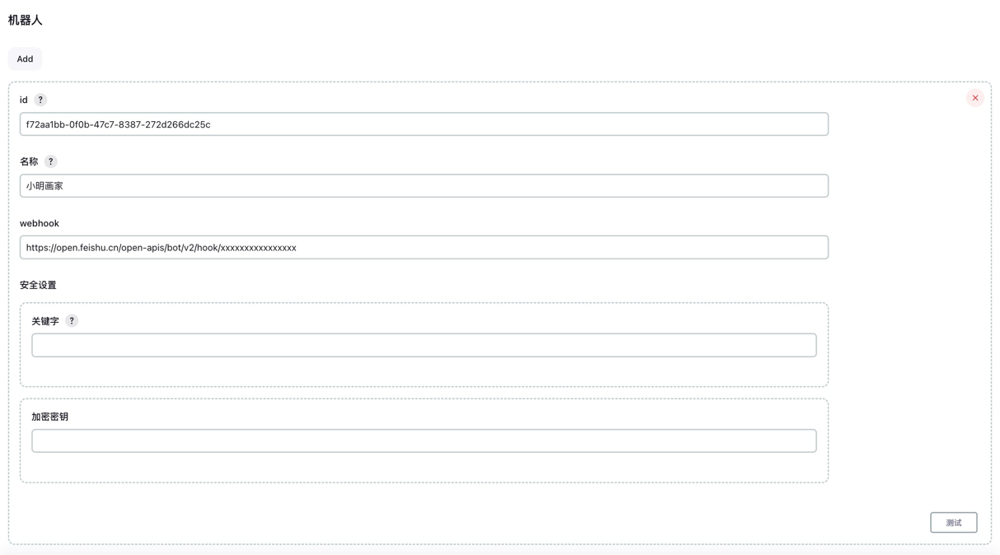

# 常见问题

### 1. 如何获取图片资源

可通过 `消息卡片搭建平台` 上传图片。应用可选择 `开发者小助手` 或 `Open Platform Assistant`，上传完成后可获得图片资源 `Key`。

- [飞书消息卡片搭建平台](https://open.feishu.cn/cardkit)
- [Lark 消息卡片搭建平台](https://open.larksuite.com/cardkit)



### 2. 无法正常加载图片

1. 检查消息中是否直接使用了图片链接。官方平台通常不支持直接引用外部图片链接，请参考“1. 如何获取图片资源”上传图片并使用图片资源 `Key`。

2. 检查图片资源 `Key` 是否与机器人所属平台一致。`飞书` 与 `Lark` 平台的图片资源 `Key` 不能混用。

### 3. 无法发送消息通知

**情况一：安装插件后未重启 Jenkins**  
安装插件后，请先重启 Jenkins，再进行通知测试。

**情况二：没有勾选通知时机**  
请在配置页面勾选对应的 `通知时机`，然后重新启动 Jenkins。


**情况三：没有正确配置加密密钥**  
请检查飞书或 Lark 控制台中是否已启用对应的 `签名校验`。如果已启用，请在机器人配置中正确填写 `加密密钥`。


### 4. 点击消息按钮无法正常跳转

**情况一：未配置 Jenkins Location URL**

打开 `Manage Jenkins` -> `Configure System`，找到 `Jenkins Location` 配置项，填写 `Jenkins URL` 后重启 Jenkins。

### 5. Jenkins 停止 / 重启 / 重载

```shell
# 格式：https://[jenkins-server-address][:port]/[command]
 
# 退出
https://[jenkins-server-address][:port]/exit
 
# 重启
https://[jenkins-server-address][:port]/restart
 
# 重载
https://[jenkins-server-address][:port]/reload
```
