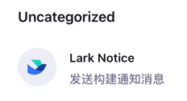

# 快速开始

- [快速搭建 Jenkins 服务](https://blog.csdn.net/qq_38765404/article/details/123497710/)
- [Lark 自定义机器人指南](https://open.larksuite.com/document/client-docs/bot-v3/add-custom-bot)
- [飞书自定义机器人指南](https://open.feishu.cn/document/client-docs/bot-v3/add-custom-bot)
- [钉钉自定义机器人指南](https://open.dingtalk.com/document/orgapp/custom-robots-send-group-messages)

## 环境准备

开始之前，请确认运行环境满足以下要求：

| 名称      | 版本       |
|---------|----------|
| Jenkins | 2.528.3+ |

## 在线安装

当前版本可能无法通过 Jenkins 更新中心直接获取。如果 `Jenkins` 更新中心地址（升级站点）不是 [官方镜像源](https://updates.jenkins.io/update-center.json)，通常无法检索到最新版本。

## 离线安装

建议优先通过发布页下载插件包：

- [GitHub Releases](https://github.com/721806280/lark-notice-plugin/releases)
- [Gitee Releases](https://gitee.com/xm721806280/lark-notice-plugin/releases)

在 Jenkins 中安装插件的步骤如下：

1. 打开 `系统管理` -> `插件管理`。
2. 进入 `Advanced` 或 `高级` 页面。
3. 在 `Deploy Plugin` 区域上传下载好的插件包，或填写插件地址。
4. 提交安装并按提示完成 Jenkins 重启。

## 机器人配置

### 全局配置

打开 `Manage Jenkins` 页面，找到 `Lark Notice` 配置项。



进入全局配置页面后，可新增机器人、配置签名校验和通知时机等参数。


### 添加机器人

添加机器人时，请根据目标平台填写对应的 `Webhook`、`加密密钥` 及相关配置项。


### Jenkins 重启

插件安装或关键配置调整完成后，可通过以下地址执行 Jenkins 重启：

```shell
# 重启服务
https://[jenkins-server-address][:port]/restart
```
