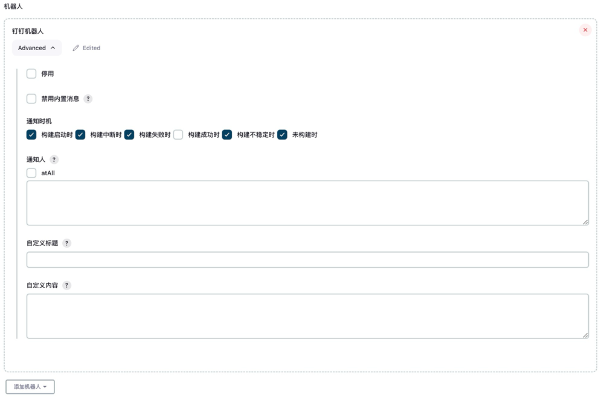
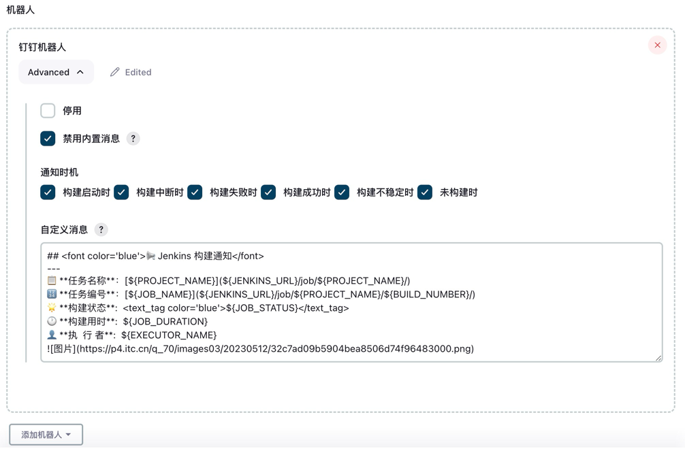

# Freestyle 项目

以下示例适用于 `Freestyle` 任务中通过插件界面配置钉钉机器人通知的场景。

## 1. 机器人配置

在全局配置中添加钉钉机器人后，可在 Freestyle 任务中选择对应机器人。



## 2. 自定义消息内容

以下示例展示了自定义 Markdown 消息内容的配置方式。



```text
## <font color='blue'>📢 Jenkins 构建通知</font>  
---  
📋 **任务名称**：[${PROJECT_NAME}](${JENKINS_URL}/job/${PROJECT_NAME}/)  
🔢 **任务编号**：[${JOB_NAME}](${JENKINS_URL}/job/${PROJECT_NAME}/${BUILD_NUMBER}/)  
🌟 **构建状态**:  <font color='blue'>${JOB_STATUS}</font>  
🕐 **构建用时**:  ${JOB_DURATION}  
👤 **执  行 者**:  ${EXECUTOR_NAME}  

```
