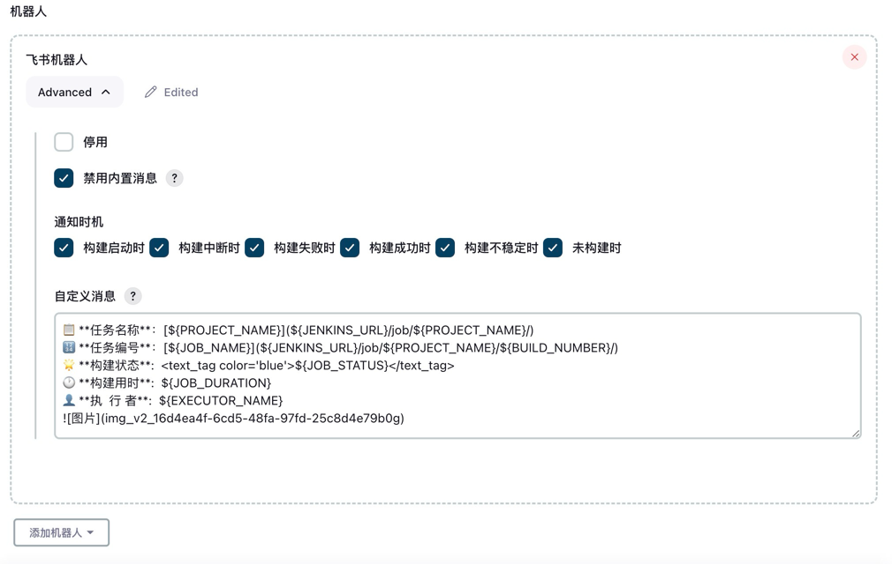
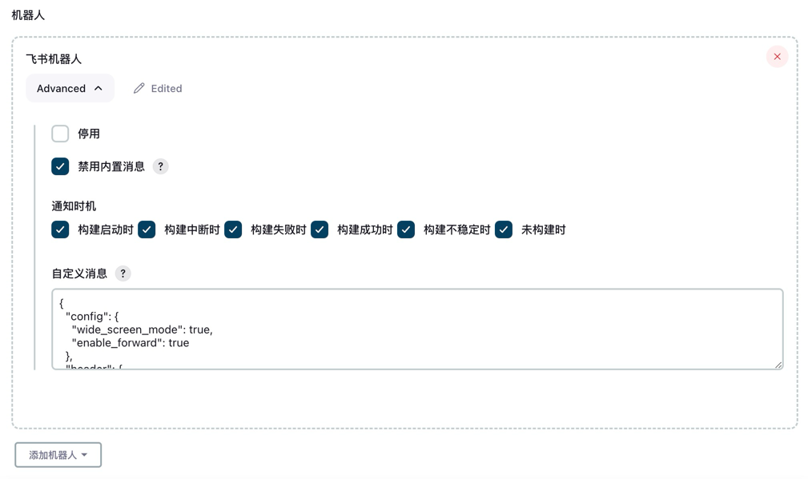

# Freestyle 项目

## 1. 机器人配置


## 2. 自定义消息内容


```text
📋 **任务名称**：[${PROJECT_NAME}](${JENKINS_URL}/job/${PROJECT_NAME}/)
🔢 **任务编号**：[${JOB_NAME}](${JENKINS_URL}/job/${PROJECT_NAME}/${BUILD_NUMBER}/)
🌟 **构建状态**:  <text_tag color='blue'>${JOB_STATUS}</text_tag>
🕐 **构建用时**:  ${JOB_DURATION}
👤 **执  行 者**:  ${EXECUTOR_NAME}

```

## 3. 自定义卡片消息


通过如下 `消息卡片搭建平台` 生成卡片消息体:

- [飞书消息卡片搭建平台](https://open.feishu.cn/cardkit)
- [Lark消息卡片搭建平台](https://open.larksuite.com/cardkit)

```json
{
    "schema": "2.0",
    "header": {
        "title": {
            "tag": "lark_md",
            "content": "📢 Jenkins 构建通知"
        },
        "template": "blue"
    },
    "body": {
        "elements": [
            {
                "tag": "hr"
            },
            {
                "tag": "markdown",
                "content": "📋 **任务名称**: [${PROJECT_NAME}](${JENKINS_URL}/job/${PROJECT_NAME}/)\n🔢 **任务编号**: [${JOB_NAME}](${JENKINS_URL}/job/${PROJECT_NAME}/${BUILD_NUMBER}/)\n🌟 **构建状态**:  <text_tag color='blue'>${JOB_STATUS}</text_tag>\n🕐 **构建用时**:  ${JOB_DURATION}\n👤 **执  行 者** :  ${EXECUTOR_NAME}\n"
            },
            {
                "tag": "hr"
            },
            {
                "tag": "column_set",
                "columns": [
                    {
                        "tag": "column",
                        "width": "weighted",
                        "weight": 5,
                        "direction": "horizontal",
                        "action": {},
                        "elements": [
                            {
                                "tag": "button",
                                "type": "primary_filled",
                                "size": "medium",
                                "width": "fill",
                                "text": {
                                    "tag": "plain_text",
                                    "content": "更改记录"
                                },
                                "behaviors": [
                                    {
                                        "type": "open_url",
                                        "default_url": "${JENKINS_URL}/job/${PROJECT_NAME}/${BUILD_NUMBER}/changes"
                                    }
                                ]
                            }
                        ],
                        "vertical_align": "top"
                    },
                    {
                        "tag": "column",
                        "width": "weighted",
                        "weight": 5,
                        "direction": "horizontal",
                        "action": {},
                        "elements": [
                            {
                                "tag": "button",
                                "type": "default",
                                "size": "medium",
                                "width": "fill",
                                "text": {
                                    "tag": "plain_text",
                                    "content": "控制台"
                                },
                                "behaviors": [
                                    {
                                        "type": "open_url",
                                        "default_url": "${JENKINS_URL}/job/${PROJECT_NAME}/${BUILD_NUMBER}/console"
                                    }
                                ]
                            }
                        ],
                        "vertical_align": "top"
                    }
                ]
            }
        ]
    }
}
```