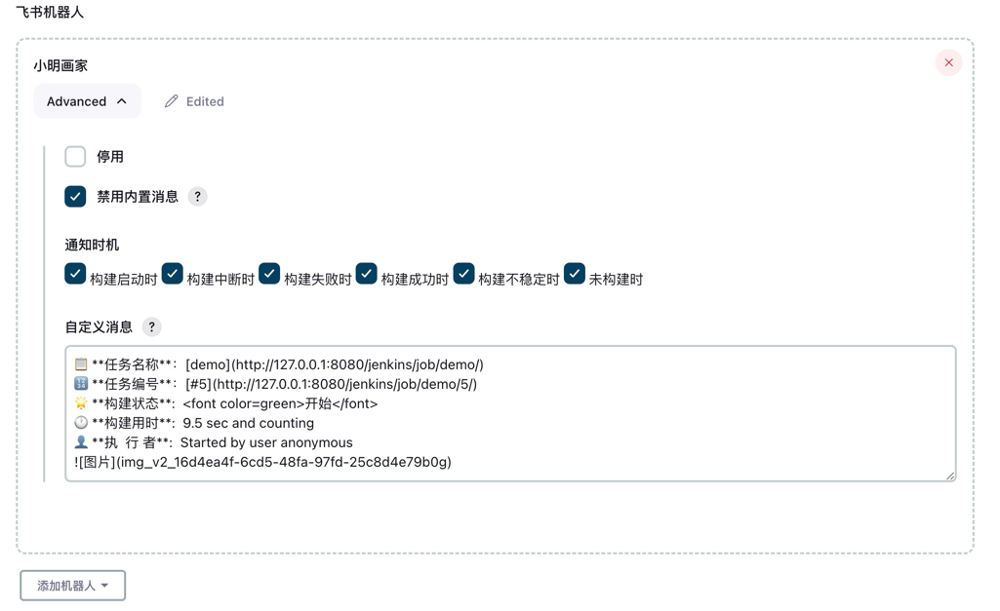
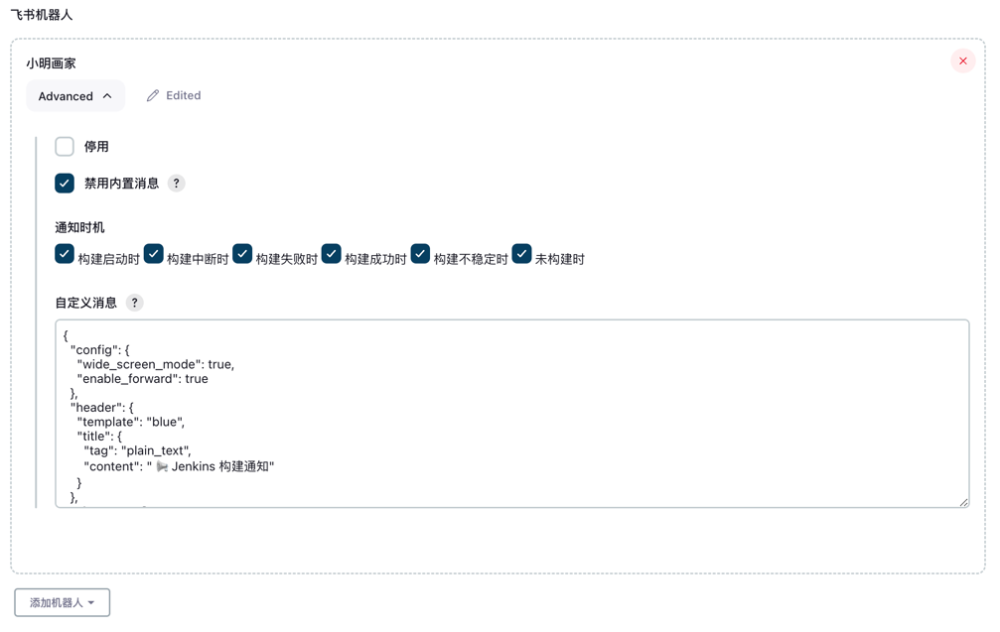

# Freestyle 项目

## 1. 机器人配置


## 2. 自定义消息(Markdown)


```text
📋 **任务名称**：[demo](http://127.0.0.1:8080/jenkins/job/demo/)
🔢 **任务编号**：[#5](http://127.0.0.1:8080/jenkins/job/demo/5/)
🌟 **构建状态**:  <font color=green>开始</font>
🕐 **构建用时**:  9.5 sec and counting
👤 **执  行 者**:  Started by user anonymous

```

## 3. 自定义消息(Json)


可通过 `消息卡片搭建平台` 生成Json消息体;

- [飞书消息卡片搭建平台](https://open.feishu.cn/tool/cardbuilder)
- [Lark消息卡片搭建平台](https://open.larksuite.com/tool/cardbuilder)


```Json
{
  "config": {
    "wide_screen_mode": true,
    "enable_forward": true
  },
  "header": {
    "template": "blue",
    "title": {
      "tag": "plain_text",
      "content": " 📢 Jenkins 构建通知"
    }
  },
  "elements": [
    {
      "alt": {
        "content": "这是正文顶部的图片哦!",
        "tag": "plain_text"
      },
      "img_key": "img_v2_cb03ec35-a638-4b93-9e6f-5e2d0e549deg",
      "tag": "img",
      "mode": "fit_horizontal",
      "compact_width": false
    },
    {
      "tag": "hr"
    },
    {
      "tag": "markdown",
      "content": "📋 **任务名称**：[demo](http://localhost:8080/jenkins/job/demo/)\n🔢 **任务编号**：[#33](http://localhost:8080/jenkins/job/demo/33/)\n🌟 **构建状态**:  <text_tag color='blue'>开始</text_tag>\n🕐 **构建用时**:  3 ms and counting\n👤 **执  行 者**:  Started by user anonymous\n"
    },
    {
      "tag": "hr"
    },
    {
      "tag": "action",
      "actions": [
        {
          "tag": "button",
          "url": "http://localhost:8080/jenkins/job/demo/33//changes",
          "type": "primary",
          "text": {
            "tag": "plain_text",
            "content": "更改记录"
          }
        },
        {
          "tag": "button",
          "url": "http://localhost:8080/jenkins/job/demo/33//console",
          "type": "primary",
          "text": {
            "tag": "plain_text",
            "content": "控制台"
          }
        }
      ]
    }
  ]
}
```