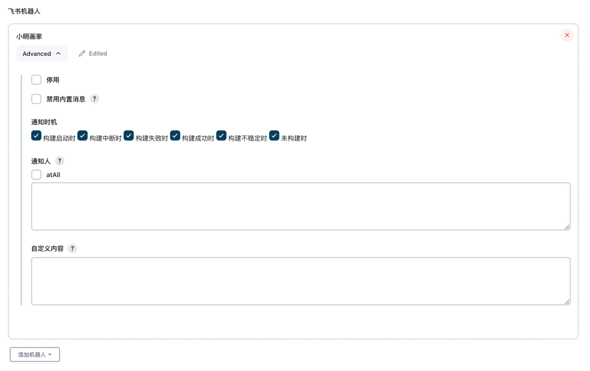
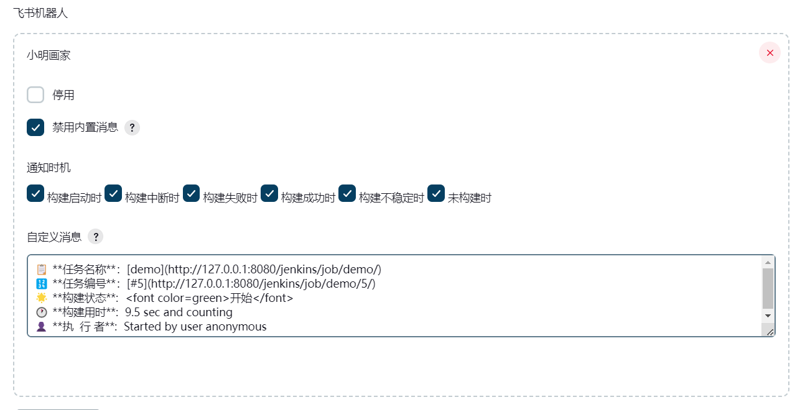

# Freestyle 项目

## 1. 机器人配置



## 2. 自定义消息


```text
📋 **任务名称**：[demo](http://127.0.0.1:8080/jenkins/job/demo/)
🔢 **任务编号**：[#5](http://127.0.0.1:8080/jenkins/job/demo/5/)
🌟 **构建状态**:  <font color=green>开始</font>
🕐 **构建用时**:  9.5 sec and counting
👤 **执  行 者**:  Started by user anonymous
```