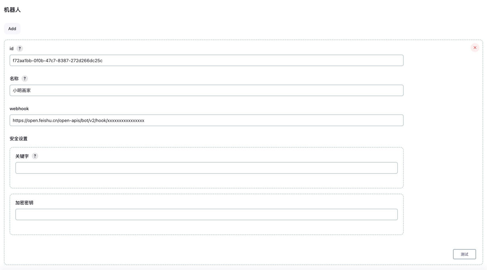

# 快速开始

- [快速搭建 Jenkins 服务](https://blog.csdn.net/qq_38765404/article/details/123497710/)
- [飞书自定义机器人指南](https://open.feishu.cn/document/client-docs/bot-v3/add-custom-bot)
- [Lark自定义机器人指南](https://open.larksuite.com/document/client-docs/bot-v3/add-custom-bot)

## 环境准备

开始之前，请先确保您已经配置好以下环境

| 名称         | 版本       |
|------------|----------|
| Jenkins    | 2.414.3+ |

## ~~在线安装~~(暂不支持)
如果 `Jenkins` 更新中心地址（升级站点）非[官方镜像源](https://updates.jenkins.io/update-center.json)，可能无法获取最新的版本;

## 离线安装

建议使用 `国内` 地址进行下载!

- [飞书 Jenkins 通知插件(梯子)](https://github.com/721806280/feishu-notification-plugin/releases/download/v1.2.2/feishu-notifications.hpi)
- [飞书 Jenkins 通知插件(国内)](https://gitee.com/xm721806280/feishu-notification-plugin/releases/download/v1.2.2/feishu-notifications.hpi)

从 Jenkins 首页开始，点击 `系统管理` -> `插件管理` , 找到 `Deploy Plugin` 选项后输入插件地址后点击 `deploy` 即可;


## 机器人配置

- 全局配置

打开 `Manage Jenkins` 页面，找到 `飞书` 配置项，如下图所示：


点击进入 `全局配置` 页面


- 添加机器人



- Jenkins重启
```shell
# 重启服务
https://[jenkins-server-address][:port]/restart
```
