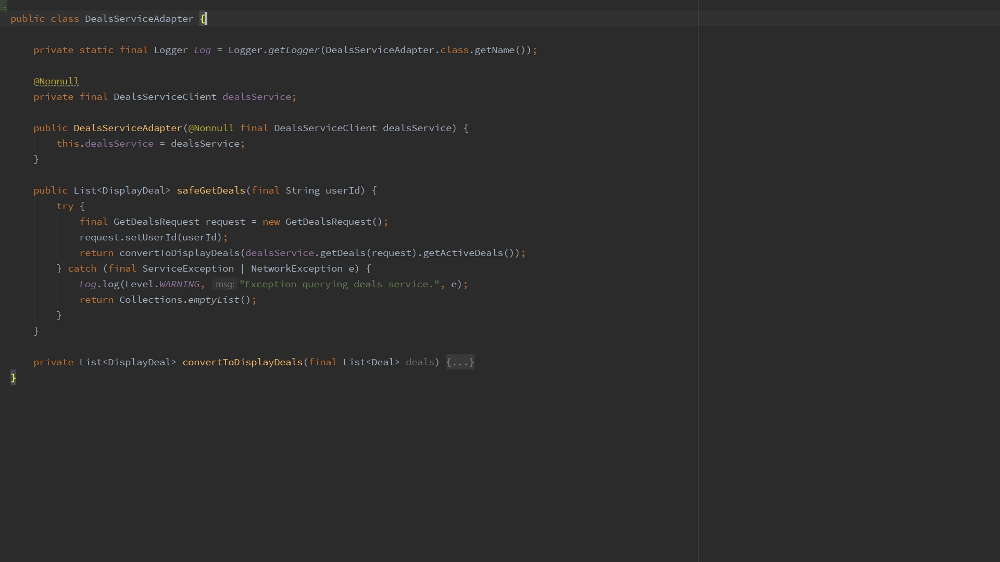
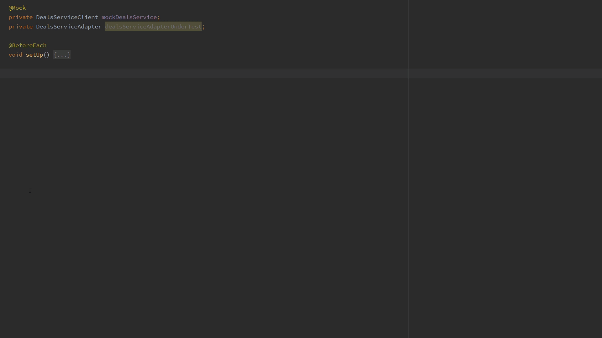
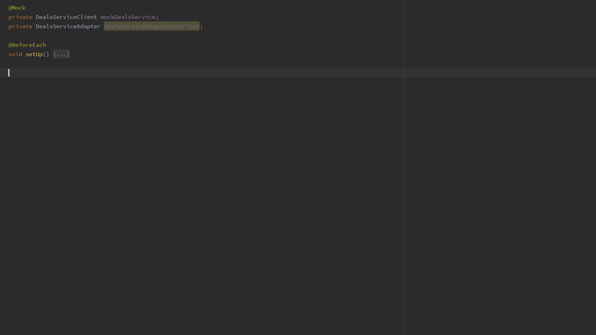

# Squaretest Java 单元测试生成器

`Squaretest` 是 IntelliJ IDEA 的单元测试生成插件，可用于为 Java 源类自动生成测试类和测试方法。

生成的测试类通常包含源类实例构造、依赖初始化、Mockito 存根以及方法调用结果校验等内容。

## 为 Java 类创建测试类

- 选择 **Squaretest | Generate Test - Ask to Confirm Mocks**（`Alt+Insert` -> `Generate Test - Ask to Confirm Mocks`）为 Java 源类生成测试类。

- 也可使用可配置的快捷键生成测试类：Windows 和 Linux 默认为 `Ctrl+Alt+K`，macOS 默认为 `Cmd+Shift+L`。

## 创建默认的测试方法

选择 **Squaretest | 生成测试方法**（`Alt+Insert` -> `生成测试方法`），可查看当前类可添加的测试方法列表。

该列表通常会包含源方法的不同执行分支示例。例如，当源方法调用 `foo.bar()` 且 `bar()` 可能抛出 `IOException` 时，Squaretest 会建议生成类似 `testMethodName_FooThrowsIOException()` 的测试方法。

## 根据建议创建测试方法

输入目标测试方法名称后，插件会基于源类方法给出候选建议。选择对应建议后即可生成相应测试方法。

