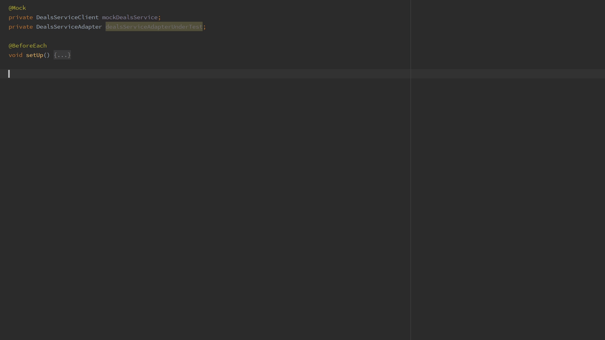

# Squaretest Java 单元测试生成器

IntelliJ IDEA 的 Squaretest 插件允许您自动为 Java 源类生成单元测试。
生成的测试类包含构造源类实例（如果需要）和初始化
依赖于模拟或合理的默认值。 测试类包括调用相应源方法的测试方法
并将返回值与预期值进行比较。 测试还包括 Mockito 存根； 即 when()、doAnswer() 语句和 verify() 语句。

## 为 Java 类创建测试类
- 选择 **Squaretest | Generate Test - Ask to Confirm Mocks** (Alt+Insert+Generate Test - Ask to Confirm Mocks) 为您的 Java 源类创建一个测试类。


- 使用可配置的键盘快捷键：Windows 和 Linux 上的“ctrl+alt+K”或 OS X 上的“cmd+shift+L”以 Java (1.7+) 或 Groovy 生成测试类。

## 创建默认的测试方法
选择 **Squaretest | 生成测试方法**（Alt+Insert+生成测试方法）以查看要添加到测试类的测试方法列表。
该列表包括对每个源方法的替代流程的测试； 例如 如果源方法调用 foo.bar()，并且 bar() 可以抛出 IOException，Squaretest 将建议一个名为 testMethodName_FooThrowsIOException() 的方法； 生成的测试方法将存根 foo 以在调用 bar() 时抛出 IOException。


## 根据建议创建测试方法
开始输入要创建的测试方法的名称，以查看基于源类中方法的代码完成建议； 然后选择一种建议的方法来创建它。




- [v1.8.6](https://pan.baidu.com/s/1eBYbB55hvvwhXfErDYkk8A?pwd=bst1) ⚠️ 仅供个人学习使用

```text
--- BEGIN SQUARETEST LICENSE ---
SQT1-X-QECHJVTX-YJONZWPN-SLCZLICX-QSUVXBJ
SQT1-M-USZYPHLT-GQOITNLC-ZKRSCADR-XOWBXSF
SQT1-Z-DKKIMGWO-MHNAPNKG-RRUZZMPR-DCMMTOZ
MD0CHQCNnZAdfvsaHy5kSs/Lot1f7cyTS6CSF4nkVcGJAhxDKMR/s9NrTBXcpGpZdH/d3JD9+dhYk+35abQ8
--- END SQUARETEST LICENSE ---
```