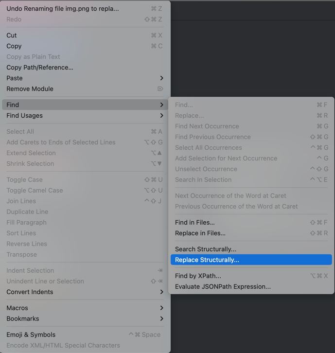
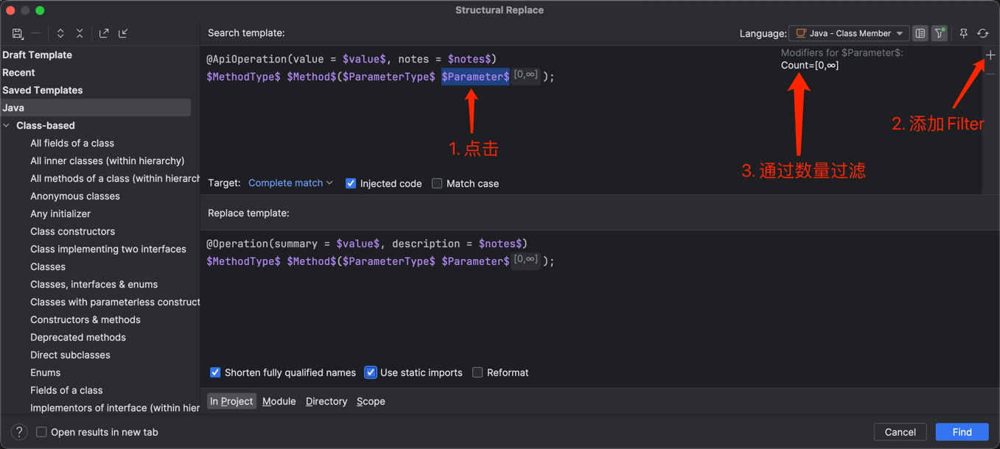
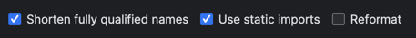
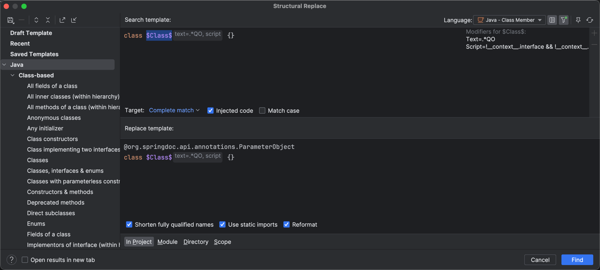

# Swagger 2.x 升级 OpenAPI 3.x 指南

`OpenAPI 3` 可以理解为 `Swagger 2` 的后续规范版本。

`Swagger` 捐赠给 Linux 基金会后，规范名称调整为 **OpenAPI Specification（OAS）**。

`OpenAPI 3.0` 规范于 2017 年发布。

本文档用于说明 Java 应用从 `Swagger 2.x` 迁移到 `OpenAPI 3.x` 的常见步骤。


## 1. 升级依赖

原依赖：

```xml
		<dependency>
			<groupId>io.swagger</groupId>
			<artifactId>swagger-annotations</artifactId>
		</dependency>
		<dependency>
			<groupId>io.swagger</groupId>
			<artifactId>swagger-models</artifactId>
		</dependency>
```

替换为：

```xml
		<dependency>
			<groupId>io.swagger.core.v3</groupId>
			<artifactId>swagger-annotations</artifactId>
		</dependency>
		<dependency>
			<groupId>io.swagger.core.v3</groupId>
			<artifactId>swagger-models</artifactId>
		</dependency>
```

> `OpenAPI` 相关注解或模型类通常以 `io.swagger.v3.oas` 为包名前缀，使用时请注意区分旧版本包名。


## 2. 注解替换

> 本文仅列出常见注解和属性替换方式，实际迁移时请结合项目中的具体使用情况调整。


### 2.1 替换 @ApiOperation => @Operation

- IntelliJ IDEA 全局替换导包（Windows 快捷键 `Ctrl + Shift + R`）：

    ```java
    import io.swagger.annotations.ApiOperation;
    ```
    
    ```java
    import io.swagger.v3.oas.annotations.Operation;
    ```


- IntelliJ IDEA 结构化替换：

    **结构化替换后，不会自动保留未显式映射的其他属性。因此，建议先替换同时包含 `value` 和 `notes` 属性的注解，再替换仅包含 `value` 的注解。如果项目中 `@ApiOperation` 使用了更多属性，请按由多到少的顺序梳理替换规则。**

    操作路径：`Edit` -> `Find` -> `Replace Structurally`
    
    
    
    
    
    在弹窗中输入搜索模板和替换模板，并根据需要配置模板规则：
    
    search template:
    
    ```java
    @ApiOperation(value = $value$, notes = $notes$)
    $MethodType$ $Method$($ParameterType$ $Parameter$);
    ```
    
    replace template:
    
    ```java
    @Operation(summary = $value$, description = $notes$)
    $MethodType$ $Method$($ParameterType$ $Parameter$);
    ```
    
    
    
    
    **为 `$Parameter$` 添加 `filter`，并将 `count` 设置为 `[0, 无穷大]`，表示匹配任意数量参数的方法。**
    
    
    
    
    
    这两个选项建议勾选，分别表示使用短类名和静态导入。

    如果不勾选，替换后的注解会保留完整限定类名，例如 `@io.swagger.v3.oas.annotations.Operation`。
    
    


- 完成上述替换后，再处理仅包含 `value` 属性的 `@ApiOperation`：


    ```java
    @ApiOperation(value = $value$)
    $MethodType$ $Method$($ParameterType$ $Parameter$);
    ```
    
    ```java
    @Operation(summary = $value$)
    $MethodType$ $Method$($ParameterType$ $Parameter$);
    ```


### 2.2 替换 @Api => @Tag

- IntelliJ IDEA 全局替换导包：

    ```java
    import io.swagger.annotations.Api;
    ```
    
    ```java
    import io.swagger.v3.oas.annotations.tags.Tag;
    ```


- IntelliJ IDEA 结构化替换：

    > 替换后仅保留 `name` 属性。如果项目中的 `@Api` 使用了更多属性，请参考 2.1 节的方法，按由多到少的顺序逐步替换。
    
    ```java
    @Api(tags= $tag$)
    class $Class$ {}
    ```
    
    ```java
    @Tag(name = $tag$)
    class $Class$ {}
    ```


### 2.3 替换 @ApiModel => @Schema

- IntelliJ IDEA 全局替换导包

    ```java
    // 原包名
    import io.swagger.annotations.ApiModel;	
    // 替换为
    import io.swagger.v3.oas.annotations.media.Schema;
    ```
    
    ```java
    // 原包名
    import io.swagger.annotations.ApiModelProperty;
    // 替换为，可能会出现重复导包，统一格式化后即可解决
    import io.swagger.v3.oas.annotations.media.Schema;
    ```


- IntelliJ IDEA 结构化替换

    ```java
    @ApiModel(value = $value$)
    class $Class$ {}
    ```
    
    ```java
    @Schema(title = $value$)
    class $Class$ {}
    ```
    
    
    
    ```java
    @ApiModelProperty(value = $value$)
    $FieldType$ $Field$ = $Init$;
    ```
    
    ```java
    @Schema(title = $value$)
    $FieldType$ $Field$ = $Init$;
    ```


### 给 QO 添加 @ParameterObject 注解

如果分页查询参数封装在以 `QO` 结尾的对象中，可添加 `@ParameterObject` 注解，将 `GetMapping` 中的对象参数展开显示。否则，`Swagger UI` 中通常会显示为 JSON 对象参数。



```java
class $Class$ {}
```

```java
@org.springdoc.api.annotations.ParameterObject
class $Class$ {}
```

filter 规则如下：
```java
Text = .*QO$
Script = !__context__.interface && !__context__.enum && !__context__.record
```


## 3. 其他替换项

上文未覆盖所有注解替换场景。对于更多迁移项，可参考 springdoc 官方文档：

https://springdoc.org/#migrating-from-springfox

`Swagger 3` 注解已包含在 `springdoc-openapi-ui` 依赖中，其包名为 `io.swagger.v3.oas.annotations`。

- `@Api` → `@Tag`
- `@ApiIgnore`→`@Parameter(hidden = true)`或`@Operation(hidden = true)`或`@Hidden`
- `@ApiImplicitParam` → `@Parameter`
- `@ApiImplicitParams` → `@Parameters`
- `@ApiModel` → `@Schema`
- `@ApiModelProperty(hidden = true)` → `@Schema(accessMode = READ_ONLY)`
- `@ApiModelProperty` → `@Schema`
- `@ApiOperation(value = "foo", notes = "bar")` → `@Operation(summary = "foo", description = "bar")`
- `@ApiParam` → `@Parameter`
- `@ApiResponse(code = 404, message = "foo")` → `@ApiResponse(responseCode = "404", description = "foo")`
